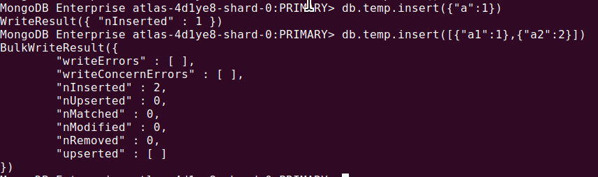
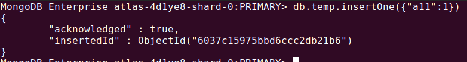
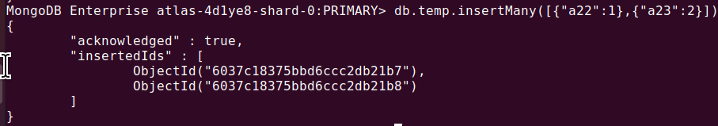
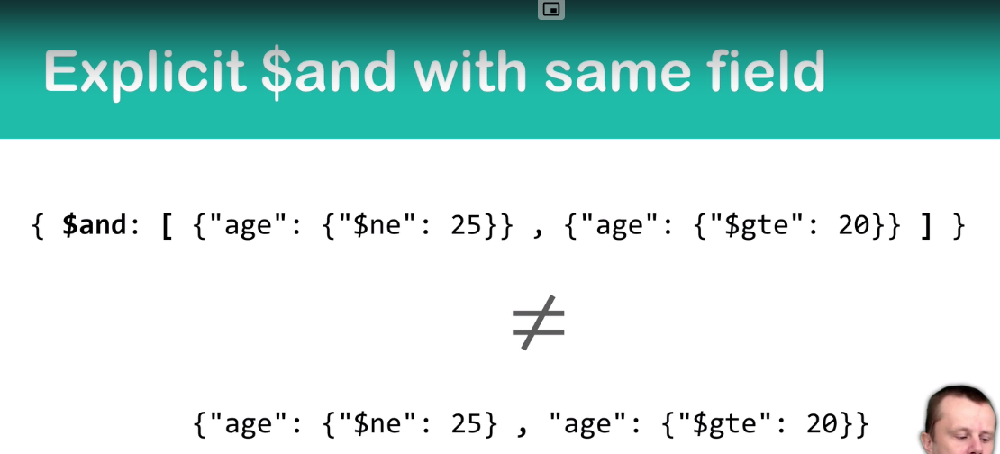

# Mongo Shell Commands

## Verify mongo server versions
1. mongod --version
2. db.version()
3. db.serverBuildInfo()
---
## Verify mongo shell versions
1. mongo --version
2. version()
---
## Getting help while working
1. help
1. db.help()   
---
## Before starting mongo we need to have atleast one admin

lets create one
```javascript
> use admin
> db.createUser({
    user:"admin",
    pwd:"strong_password",
    roles:[
        {
            role:"root",
            db:"admin"
        }
    ]
})
// verify instance user via
> show users
```


## CRUD OPERATIOND

<center><h1>Create</h1></center>

| Command | description |
| ----:| :--- |
| use | used to create databases |
| db.createCollection('collection_name') | used to create collections |

---

<center><h1>Read or Get</h1></center>

| Command | description | returns |
| ----:| :--- | ----|
| show dbs | show all the available databases in current connection <br/>(Note: it shows the databases names who has atleast a collection|| 
| db | show active database ||
| show collections | show all available collections in active database||
| db.getCollection() | get collection details ||
| db.collection.find([query,fields]) <br> query and fields are optional parameters | display all documents present in collection| returns cursor, this can be iterated to get extended JSON document and <br> ### Note : in this command if collection_name is wrong, mongodb doesnt throw any error nor does return any data
| db.collection.findOne([query,fields]) <br> query and fields are optional parameters  | display only one document <br> | returns single extended JSON document


<center><h1>Update</h1></center>

--- 

<center><h1>Delete</h1></center>

| Command | description |
| ---: | :--- |
| use <database_name> <br/>  db.dropDatabase() | used to drop active database |
| db.getCollection("collection_name").drop() | drop a collection from active database |
| db.collection.remove({}) | removes all documents from collection|

---

<center><h1>Insert</h1></center>

**Differnece between these methods mainly lies in the output printed by mongo**

**You can pass _id in following methods as well but it is not advisable as it can throw Duplicate _id error**

| Command | description | output | Example |
| ---: | :--- | ---- | ---- |
db.collection.insert( object or array ) | you can insert one or more documents in an collection| after execution it returns writeResults or bulk write results object |  |
db.collection.insertOne( object ) | you can insert only one document in collection| after execution return id of inserted document |  |
db.collection.insertMany( array )| you need to insert one or more object in collection but needs to pass data in an array| after execution returns array of all document ids of inserted documents |  |


---

<center><h1>Cursor</h1></center>

* used to retrieve documents from mongo server to mongo client
* Lets Run a example

    * insert a 100 collections in collection by running following code in mongo shell
        ```javascript
        var docs = [];

        for(let i=1;i<101;i++){
            obj = {"index":NumberInt(i)};
            docs.push(obj)
        }
        db.cursorExample.insertMany(docs)
        ```
    * Lets Iterate Cursor over these items in mongo shell : 
        ```javascript
        db.cursorExample.find() // this returns 20 documents
        ```
    * Difference Between Batch Size and Iterator Size
         | Batch Size | Iterator Size |
         | ---- | --- |
         | this is mainly number of documents sent by server to client | this is just normal iteration count at client side |
         | this gets data until cursor is exhausted| the iterator doesn not exhaust as the data present at client is session/refresh wise|
         | Initial Batch size is 101 documents or 1 MB | Mongo DB Iterator size is 20 documents|
         | Next batch size is 4 MB but 101 documents|
         | Maximum batch size is 16MB but 101 documents|

    * we can both batch and interator size

    * Chaging Mongo-shell iterator size
        ```bash
        $ help
        $ DBQuery.shellBatchSize = 10 //reducing from 20 to 10
        ```

    
    * Chaging Mongo-shell iterator size
        ```bash
        db.collection.find().batchSize(30)
        ```

    * Cursor methods

        ```bash
        var cursor = db.collection.find({})
        ```
      * cursor.hasNext() 
      * cursor.next() - fetches next document from iterator
      * cursor.toArray() - fetches all documents in an array
      * cursor.forEach( function ) - perform function on each element in cursor
      * cursor.count() - lists number of documents in an collection
      * cursor.limit(number)
      * cursor.skip(number)
      * cursor.sort({<br>
          field1 : 1, (ascending) <br>
          field2 : -1 (desending) <br>
      })
    
    * Order of execution of above methods - 

        ```bash
        db.getCollection("cursor").limit(10).skip(20).sort({"_id" : -1})
        ```

        1. the documents are sorted descendingly by _id
        2. then performs skip operation
        3. then limits result to 10 documents
        
        > ## this is not dependent on order we write but the priority of execution of 
        > ## find > count > sort > skip > limit

---

<center><h1>Queries</h1></center>

## 1.  Importing file(JSON) data into mongodb
   1.  Via Mongo Import, in local mongodb : 
        
        ```mongoimport  --db dbName --collection collectionName < fileName.json```
   2.  Via Mongo Import, in remote mongodb :
   
        > ### mongoimport --uri mongodb+srv://admin:<PASSWORD>@<HOST>/<DATABASE> --collection <COLLECTION> --type <FILETYPE>( with "json" or "csv") --file <FILENAME>

        append following for above commands: <br>
        --jsonArray : if your json has multiple jsons <br>
        --legacy : if your json values contains datatypes of mongodb (like NumberInt, ISODate)

   3.  Via InsertMany(.. paste your json)

## 2.  Query Documents : Searching with exact Matches and  logical "AND"
```javascript
db.collection.find({
    <field1> : <value1>,
    <field2> : <value2>,
    ...
})
```
## 3. Searching with other operators 
  1. means searching in db other than exact key value pairs, this involves > , < , similar etc
  2. Syntax : ```{ key : {<oper> : "value1" } }``` where oper are

| operator | mongo declaration| Example|
| --- | ---| ---- |
| > | $gt ||
| < | $lt ||
| >= | $gte ||
| <= | $lte ||
| in | $in ||
| not in | $nin ||
| ! | $ne ||
| && | $and : [ {k1:v1},{k2:v2}.. ] <br> this is called as **explict AND** opertaor because this opertor allows to check multiple conditions on the same key||
| \|\| | $or  : [ {k1:v1},{k2:v2}.. ] | |

### $and example:
```javascript
db.getCollection("Persons").find({
    $and:[
        {
            "gender":"female"
        },
        {
            "favoriteFruit":"banana"
        }
    ]
})
```
vs

```javascript
db.getCollection("Persons").find({
"gender":"female"
},
{
 "favoriteFruit":"banana"
})
```

---

## Basic commands
1. cls - clear screen
2. help -lists help
3. rs.status() = gives info on replica sets
4. show dbs - show all databases present in mongodb in local. Defualt one are 
      1. admin
      2. config
      3. user
5. use <database name> : to create and use (or) use exising database. After using this command ig any database has no collection with records then those databases are not shown
6.  show collections 
7.  db.createCollection('collection_name') : to create tables
8.  db.collection_name.find() : to view all records/objects present in a given collection

9. db.collection_name.find().pretty() : pretty print
10. db.collection_name.update({'key1': 'value1'}, $set:{ 'key':'value2' }) : 
    * In the following command the first json is the query one 
    * thus mongo first searches all records who has key as 'key1' and that key has value as 'value1'
    * After all such records it update those record's 'key' named value as 'value2'

11. Search One : db.collection_name.findOne({key:value}) : view one records who has KV pairs with key as 'key' and value as 'value'
12. db.Collection_name.drop : to drop a table
