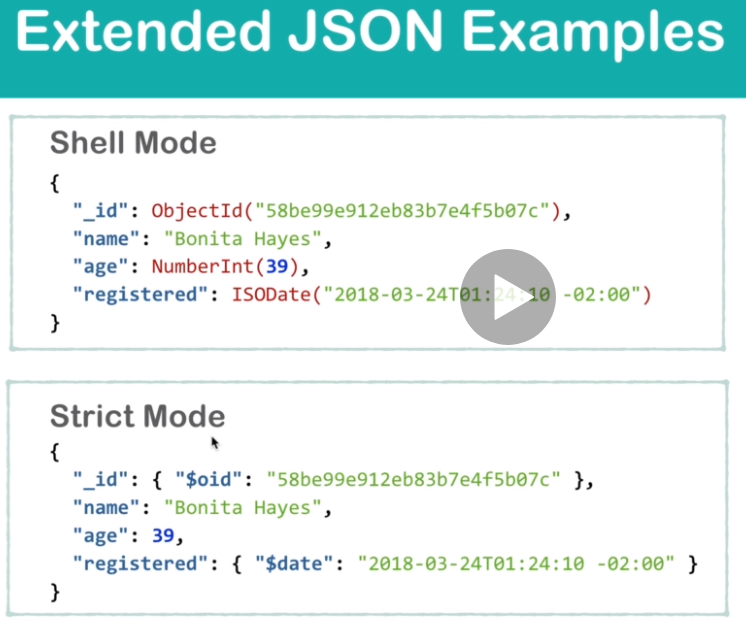
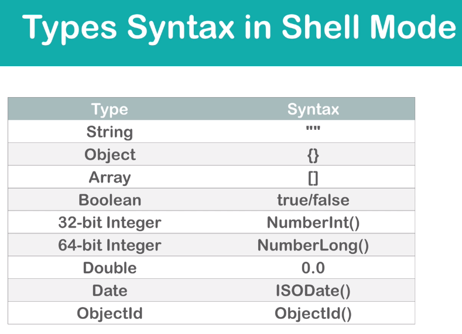
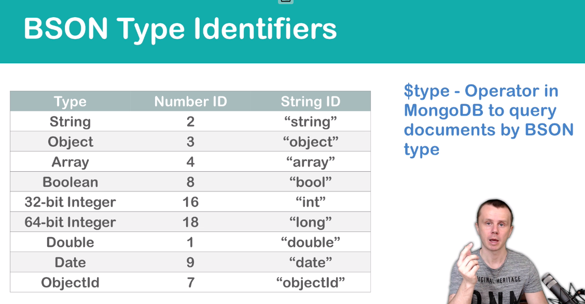
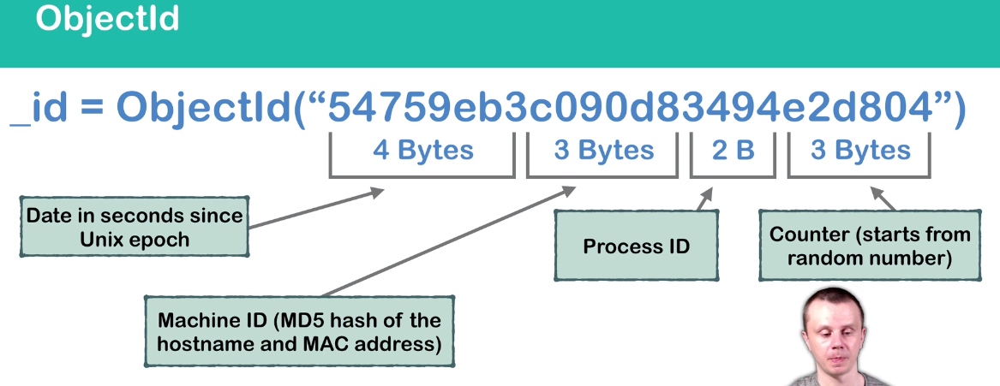

# Introduction

1. Schema independent. Based on BSON-> Binary JSON

2. Document Oriented (data stored in form of objects)
3. group of objects called as collection, group of collections called as Databases
4. Able to scale horizontally-> this is called as Auto Sharding
5. If you installed via the package manager, the data directory **_/var/lib/mongodb_** and the log directory **_/var/log/mongodb_** are created during the installation.
6. The official MongoDB package includes a configuration file (**_/etc/mongod.conf_**). These settings (such as the data directory and log directory specifications) take effect upon startup.

|Mongo | RDBMS |
|---|---|
|Collections| tables|
|document|row|
|field|column|
|schema less: you can declare new fields| schema dependent: once you declare column, new column at run time are not allowd|
|||


No SQL Databases:
1. mongo - document bases - mainlyused to large amount of un-related information, also varies in structure -- mainly used in ecommerce, blogging, analytics

2. redis - key value paired - mainly used for caching, queueing
3. graph - neo4j - mainly used to aggregation like functionality such as calculating avergae or deriving mean values
4. cassandra - column based - mainly used to get information from data relationships -- mainly used in amazon and facebook for suggestions
5. AMAZON DYNAMO DB - this is combination of key-value pair and document based database which is used for complex functionalities

---

# JSON Data types

1. string
2. array
3. object
4. boolean
5. numbers
6. decimals
7. null

# BSON (Binary JSON) Data types

1. Above all
2. 32-bit & 64-bit integer
3. Regular expression
4. timestamp
5. binary data
6. objectId
7. date
8. Double
9. Integer <br>

[continuation](#BSONExtended)

# Conversion JSON to BSON

Mainly includes convertion of integer(JSON) to double/32-bit/64-bit values. The conversion is **Extended JSON** . The extended JSON modes are 

1. ## Inline Mongo Shell

   *  internal mongodb mode which is understandable to mongo shell
   *  Here we use internal mongo functions to represent data like ObjectId which takes an input

---
1. ## Strict Mode

    * Represents BSON types by special character with preappending with $
    * So any key that starts ith $ is its data type. Ex $date:".."
    * fully compitable to JSON
    * So it is used by JSON parsers
    * this  Extended JSON Mode fully conforms to JSON format

Note: The above 2 modes are available in mongo-db-drivers, REST API and mongo import Utility. Mongo Export Utility only allows strict mode.



---

[Starting Mongo DB](https://docs.mongodb.com/manual/tutorial/install-mongodb-on-ubuntu/)

---

# Mongo Architecture

when you download mongodb you get following things


1. mongod : its a server utility from mongodb that can run continuously 
2. mongo-shell : its a shell utlity to connect to server via shell
   *  ## This is based on Javascript
   *  ## From v3.2, Mongo Uses SpiderMonkey Javascript Engine
   *  ## Supports ES6
   *  ## Supports Server Side Scripts
   *  If you want check javascript version you can use following command
        1. interpreterVersion() - commands shows version number of javascript interpreter(spider monkey)
        2. db.serverBuildInfo() - same as above but with way more info

3. mongo-dump : 
4. mongo-store : 
5. mongo-stat : monitor real time performance of mongo server
6. mongo-export :
7. mongo-import :
8. mongo-connectors : get access of shell of remote mongo db server


# Mongo DB Shell Syntax

```
db.version
```

In the above command, executed in shell where

db - is a javascript
version() - invoking version function on db object. Hence version is clearly a function


---

# Remote MongoDB Management

Initially if you want to connect to remote mongo server,
1. you need to connect to remote system via ssh
2. then in ssh you need to get shell access to connect to mongo server

which is inconvient... Hence we have mongo-clients to be downloaded in order to get access of shell of remote mongo db server

In order to connect mongo db from one server to another(backend to frontend) we need mongodb-driver for respective programmic language.

Note : For above type of connections you should always use it with SSL Encryption as data is sent as plain text(strongly recommended)

# MongoDB Installations Options

1. local server : education purpose
2. Dedicated or Virtual Managed Servers
   1. Full Control

   2. Scalability option
   3. runs 24/7
   4. needs to be properly configured and needs proper management
   5. Examples:
      1. Digital Ocean

      2. Hetzner
      3. Go-daddy
      4. Amazon EC2

3. CaaS : Cloud Database as a Service
   1. Ready for production and Mainly used for production

   2. Replica Set out of the box
   3. easy management and scalability
   4. free size-limited options

# [BSON Types In Depth](#BSONExtended)



Lets do an exercise in shell

```bash
var  obj = { a:"", b:[], c:{}, d:true }

print(obj)
print(typeof(obj.a))
print(typeof(obj.b))
print(typeof(obj.c))
print(typeof(obj.d))

print(obj.b instanceof Array)
print(obj.c instanceof Array)
```
output
```bash
/* 1 */
{
    "a" : "",
    "b" : [],
    "c" : {},
    "d" : true
}
string
object
object
boolean
true
false
```
you can see that {} and [] belong to object type, but you can differentiate them from instanceof Array check

## Note : BSON types assings data types when we assign a value to a key. Thus for string, boolean, arrays and object the types are preserved and used as common JS types
---
## BSON  Type Identifiers

* Each bson type has unique identifer (numberid and stringid). 
* These IDS are used with $type operator to assing a data type to a key manually in mongodb-shell. 
* This also helps us to query the documents via types



## _id purpose:

* Each document must have a unique id acorss mongodb database, this id is by default is **_id**
* This field can be assigned manually(when we export and import an databse.. the ids present in exorted are same as in imported), but when we are create documents these are assigned automatically
* objectId() - gives _id



## BSON Date

* all dates are stored in ISO format
* 